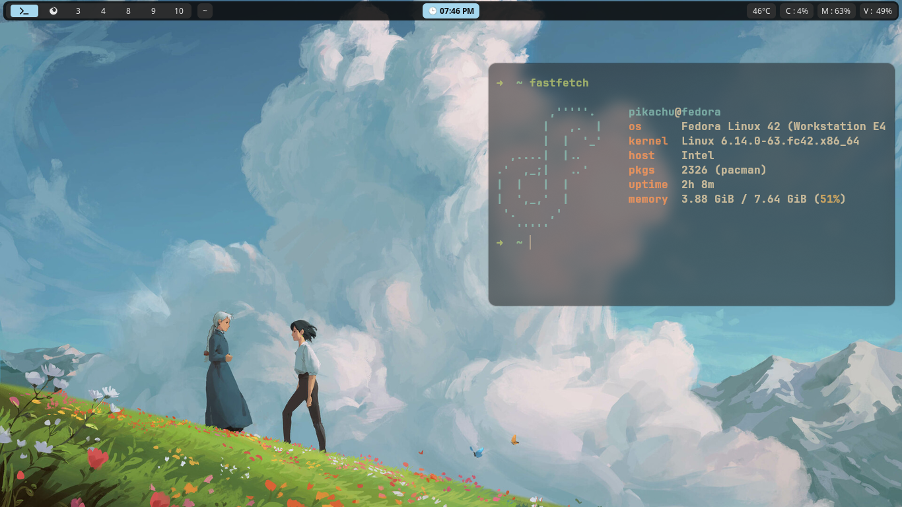
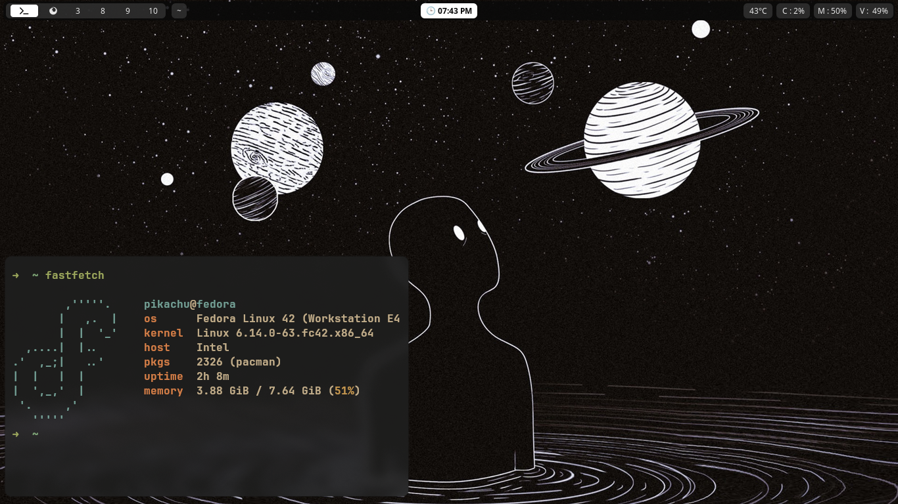
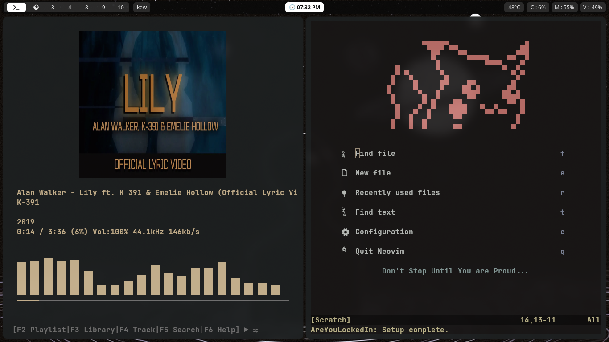
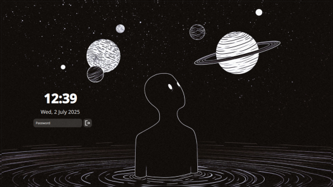
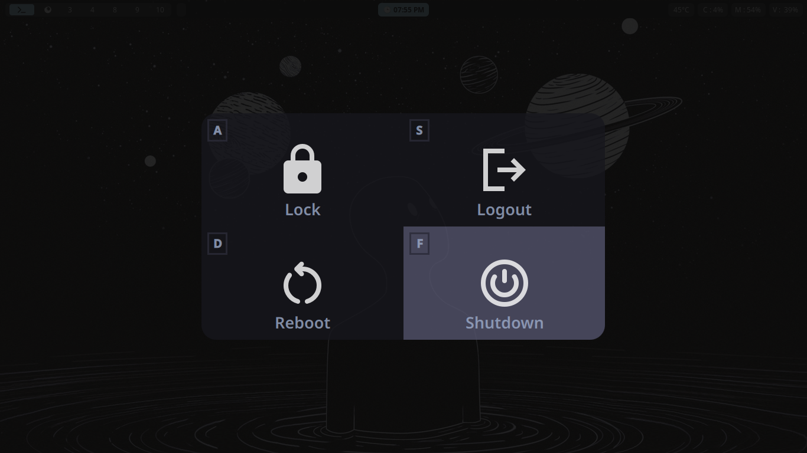

# ThePikachuDev's Rice 

- this rice is a submission for [riceathon](https://riceathon.hackclub.com/)

## Screenshots 

# Tools/Softwares I use :

- Distro : Fedora Linux
- Window Manager: Hyprland
- Code Editor : neovim ( btw )
- Music Player : kew cli 
- Status Bar : waybar
- System Fetch : fastfetch 

[###](###) about power widget and lock screen 

i used [Quickshell](https://quickshell.outfoxxed.me/) and [QML](https://doc.qt.io/) to create these widgets.
if you want to use these widgets you will have to install [Quickshell](https://quickshell.outfoxxed.me/docs/guide/install-setup/) and run them using quickshell -p /path/to/widgetDirectory command.

